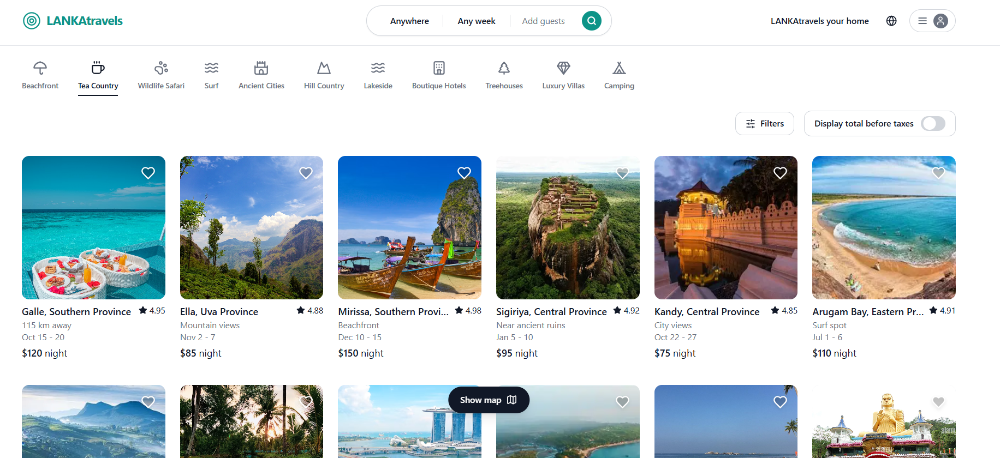

# 🎨 [Project Name]

> [One-line description — what it does, who it's for, and why it matters]


<!-- Tip: 1280×640px screenshot of your app's main view works best as a banner -->

[](YOUR_DEPLOYED_URL_HERE)
[](YOUR_GITHUB_REPO_URL_HERE)
[](YOUR_FIGMA_URL_HERE)
<!-- Remove the Figma badge if you don't have a design file -->

---

## 📌 Table of Contents

- [Overview](#overview)
- [Screenshots](#screenshots)
- [Features](#features)
- [Tech Stack](#tech-stack)
- [Getting Started](#getting-started)
- [Environment Variables](#environment-variables)
- [Deployment](#deployment)
- [Author](#author)

---

## 🧭 Overview

[Write 3–5 sentences here. What problem does this UI solve? Who is the target user? What makes the experience stand out? If it connects to a backend API, mention it briefly here.]

**Live URL:** [https://your-app.vercel.app](https://your-app.vercel.app)  
**Backend API (if applicable):** [https://your-api.onrender.com](https://your-api.onrender.com)

---

## 📸 Screenshots

### Home / Landing Page


### [Main Feature — e.g. Dashboard / Product Page / Feed]


### [Secondary Feature — e.g. Login / Form / Modal]


### Mobile / Responsive View


### Dark Mode (if applicable)

<!-- Remove this section if your app doesn't have dark mode -->

> 📁 Add all screenshots to a `/screenshots` folder in your repo root.  
> Tools to capture clean screenshots: [Screely](https://screely.com), [Cleanshot X](https://cleanshot.com), or browser DevTools device mode.

---

## ✨ Features

- [ ] [Feature 1 — e.g. Fully responsive layout across mobile, tablet, and desktop]
- [ ] [Feature 2 — e.g. Dynamic search and filter with instant results]
- [ ] [Feature 3 — e.g. JWT-based authentication with protected routes]
- [ ] [Feature 4 — e.g. Smooth page transitions and loading states]
- [ ] [Feature 5 — e.g. Form validation with real-time error feedback]
- [ ] [Feature 6 — e.g. Dark / light mode toggle with localStorage persistence]
- [ ] [Feature 7 — e.g. Infinite scroll / pagination]
- [ ] [Feature 8 — e.g. Toast notifications for user actions]

---

## 🛠️ Tech Stack

| Category       | Technology                                           |
|----------------|------------------------------------------------------|
| Framework      | [React.js / Vite / Next.js / Vanilla JS]             |
| Language       | JavaScript (ES6+) / TypeScript                       |
| Styling        | [Tailwind CSS / CSS Modules / Bootstrap / MUI]       |
| State Management | [React Context / Redux Toolkit / Zustand]          |
| Routing        | [React Router v6 / Next.js App Router]               |
| HTTP Client    | [Axios / Fetch API]                                  |
| Icons          | [React Icons / Lucide / Font Awesome]                |
| Animation      | [Framer Motion / GSAP / CSS transitions]             |
| Build Tool     | [Vite / Create React App / Webpack]                  |
| Deployment     | [Vercel / Netlify / GitHub Pages]                    |
| Other          | [Any other lib — e.g. Chart.js, React Hook Form, date-fns] |

---

## 🚦 Getting Started

### Prerequisites

- [Node.js](https://nodejs.org/) v18+
- [npm](https://www.npmjs.com/) or [yarn](https://yarnpkg.com/)
- [Git](https://git-scm.com/)

---

### 1. Clone the Repository

```bash
git clone https://github.com/YOUR_USERNAME/YOUR_REPO_NAME.git
cd YOUR_REPO_NAME
```

---

### 2. Install Dependencies

```bash
npm install
# or
yarn install
```

---

### 3. Set Up Environment Variables

Create a `.env` file in the root directory (see [Environment Variables](#environment-variables) below).

---

### 4. Start the Development Server

```bash
npm run dev
# or
yarn dev
```

App runs on: `http://localhost:5173`

---

### 5. Build for Production

```bash
npm run build
```

Preview the production build locally:

```bash
npm run preview
```

---

## 🔐 Environment Variables

Create a `.env` file in the project root:

```env
# API Base URL
VITE_API_BASE_URL=http://localhost:YOUR_BACKEND_PORT/api/v1
# For production:
# VITE_API_BASE_URL=https://your-api.onrender.com/api/v1

# Firebase (if used)
VITE_FIREBASE_API_KEY=your_firebase_api_key
VITE_FIREBASE_AUTH_DOMAIN=your_project.firebaseapp.com
VITE_FIREBASE_PROJECT_ID=your_project_id

# Google OAuth (if used)
VITE_GOOGLE_CLIENT_ID=your_google_client_id

# Cloudinary (if used for direct upload from frontend)
VITE_CLOUDINARY_CLOUD_NAME=your_cloud_name
VITE_CLOUDINARY_UPLOAD_PRESET=your_upload_preset

# Add any other public keys your project uses
# Note: NEVER put secret keys here — frontend env vars are public
```

> ⚠️ Only use `VITE_` prefix for Vite projects. For Create React App use `REACT_APP_` instead.  
> ⚠️ Never put secret API keys in frontend `.env` — these are exposed in the browser.

---

## 📁 Project Structure

```
root/
├── public/
│   └── favicon.ico
│
├── src/
│   ├── assets/               # Images, fonts, static files
│   ├── components/           # Reusable UI components
│   │   ├── common/           # Buttons, inputs, modals, etc.
│   │   └── layout/           # Navbar, Footer, Sidebar
│   ├── pages/                # Route-level page components
│   ├── hooks/                # Custom React hooks
│   ├── context/              # React Context providers
│   │   └── [Name]Context.jsx
│   ├── services/             # API call functions (axios/fetch)
│   │   └── api.js
│   ├── utils/                # Helper functions
│   ├── constants/            # App-wide constants and config
│   ├── styles/               # Global CSS or Tailwind config
│   ├── App.jsx
│   └── main.jsx
│
├── screenshots/              # UI screenshots for README
│   ├── banner.png
│   ├── home.png
│   ├── main-feature.png
│   ├── secondary-feature.png
│   └── mobile.png
│
├── .env                      # Not committed
├── .gitignore
├── index.html
├── package.json
├── vite.config.js            # or next.config.js / webpack.config.js
└── README.md
```

---

## 🚀 Deployment

### Vercel (Recommended for React / Next.js)

[](https://vercel.com/new)

1. Push your project to GitHub
2. Import the repo on [vercel.com](https://vercel.com)
3. Add environment variables in the Vercel dashboard under **Settings → Environment Variables**
4. Set the build command: `npm run build`
5. Set the output directory: `dist` (Vite) or `.next` (Next.js)
6. Deploy ✅

**Live URL:** [https://your-app.vercel.app](https://your-app.vercel.app)

---

### Netlify (Alternative)

1. Push to GitHub
2. Connect repo on [netlify.com](https://www.netlify.com)
3. Build command: `npm run build`
4. Publish directory: `dist`
5. Add env vars under **Site Settings → Environment Variables**

---

### GitHub Pages (for static / no backend projects)

```bash
npm install --save-dev gh-pages
```

Add to `package.json`:

```json
"homepage": "https://YOUR_USERNAME.github.io/YOUR_REPO_NAME",
"scripts": {
  "predeploy": "npm run build",
  "deploy": "gh-pages -d dist"
}
```

Then run:

```bash
npm run deploy
```

---

## 👨‍💻 Author

**Thisal Gonsalkorala**  
Full-Stack Software Engineer

[](YOUR_PORTFOLIO_URL)
[](YOUR_LINKEDIN_URL)
[](https://github.com/YOUR_USERNAME)
[](mailto:tdimith10@gmail.com)

---

## 📄 License

This project is licensed under the [MIT License](./LICENSE).

---

> Built with ☕ and attention to detail by Thisal Gonsalkorala
